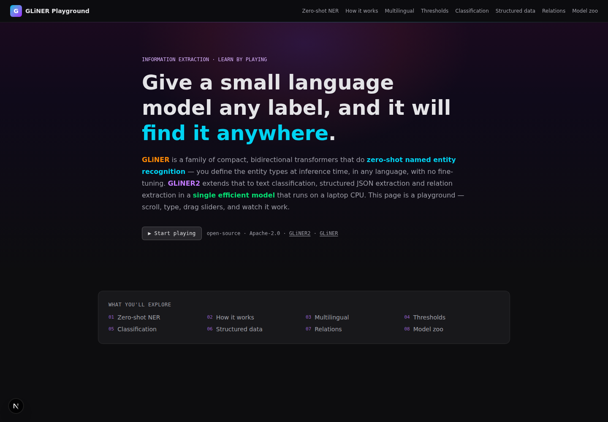

# GLiNER Playground

An interactive showcase for the **[GLiNER](https://github.com/urchade/GLiNER)** / **[GLiNER2](https://github.com/fastino-ai/GLiNER2)** family of zero-shot information extraction models — with a live FastAPI inference backend, a "learn by play" web playground, runnable CLI examples, and an automated test suite.

> **What it does:** give a small language model *any* entity label at inference time (in any of 6+ languages) and it will find it in your text — no fine-tuning, no training data. GLiNER2 extends this to text classification, structured JSON extraction and relation extraction in a single 205M-parameter model that runs on CPU.



## ✨ What's in this repo

| Piece | Path | What it does |
|---|---|---|
| **API backend** | [`backend/`](backend/) | FastAPI service wrapping 5 GLiNER/GLiNER2 models, GPU-first with CPU fallback. Normalizes all outputs so one API speaks for both model families. |
| **Web playground** | [`site/`](site/) | Next.js (static-export) "learn by play" guide. 8 interactive widgets that call the live backend, with graceful demo-data fallback so the static site works anywhere. |
| **CLI examples** | [`examples/`](examples/) | 6 runnable scripts: zero-shot NER, multilingual, multi-task, PII redaction, model comparison, news→knowledge pipeline. |
| **Tests** | [`backend/tests/`](backend/tests/) | 16 pytest cases over the API (entities, entities-long, classification, structured, relations, combined, compare, benchmark, error contracts). |
| **Deploy** | [`.github/workflows/`](.github/workflows/) | GitHub Pages action for the static site + documented backend deploy. |

## 🧠 Models bundled

| Model | Params | Languages | Tasks |
|---|---|---|---|
| `urchade/gliner_small-v2.1` | ~64M | en | NER |
| `gliner-community/gliner_medium-v2.5` | ~169M | en | NER |
| `urchade/gliner_multi-v2.1` | ~169M | en+12 | NER |
| `fastino/gliner2-base-v1` | 205M | en | NER · classification · structured · relations |
| `fastino/gliner2-multi-v1` | 205M | fr·en·es·de·it·pt | NER · classification · structured · relations |

## 🚀 Quickstart

> **Live demo:** the static learn-by-play site is deployed at
> <https://jasperan.github.io/gliner-playground/> (runs in demo-data mode until a
> backend is hosted — see [Deploying](#-deploying)).

### 1. Backend (inference API)

```bash
cd backend
uv sync                        # creates .venv with gliner2[local], fastapi, pytest
uv run python __run__.py       # serves on http://127.0.0.1:8000 (set GLINER_HOST=0.0.0.0 to expose it)
```

First model load downloads weights into `backend/models_cache/` (HF cache).
Check it's alive: `curl localhost:8000/health`

> **GPU**: auto-detected. On a plain laptop it runs CPU-only — that's the point of GLiNER.

### 2. Web playground

```bash
cd site
npm install
npm run dev                    # http://localhost:3200 → talks to localhost:8000
```

or serve the static export (works without the backend, using demo data):

```bash
npm run build                  # emits site/out
npx serve out -l 3100
```

Set `NEXT_PUBLIC_API_URL` to point the widgets at a remote backend:

```bash
NEXT_PUBLIC_API_URL=https://your-api.example.com npm run build
```

### 3. CLI examples

```bash
uv run --project backend python examples/01_zero_shot_ner.py
uv run --project backend python examples/02_multilingual.py
uv run --project backend python examples/03_gliner2_multi_task.py
uv run --project backend python examples/04_pii_redaction.py
uv run --project backend python examples/05_model_comparison.py
uv run --project backend python examples/06_news_to_knowledge.py
```

### 4. Tests

```bash
cd backend
uv run pytest tests/ -q
```

## 🔌 API surface

All endpoints are `POST` with JSON; responses include `latency_ms`.

| Endpoint | Purpose |
|---|---|
| `GET /health` | liveness + device + models |
| `GET /api/models` | model catalog with tasks/languages/params |
| `POST /api/entities` | zero-shot NER: `{text, labels, model?, threshold?}` |
| `POST /api/entities-long` | chunked NER for documents beyond 512 tokens (GLiNER2) |
| `POST /api/classify` | text classification: `{text, tasks: {task: [labels]}}` |
| `POST /api/structured` | schema-driven JSON: `{text, structures: {name: ["field::dtype::desc"]}}` |
| `POST /api/relations` | relation extraction: `{text, relation_types}` |
| `POST /api/combined` | NER + classification + structured + relations in one pass (schema builder) |
| `POST /api/compare` | same NER task across multiple models side-by-side |
| `POST /api/benchmark` | warm-cached latency benchmark over N iterations |

Interactive docs: `http://localhost:8000/docs`

## 🌐 Deploying

### Static site → GitHub Pages

Push to `main`; the included workflow at `.github/workflows/deploy.yml` builds and publishes `site/out` to `https://<user>.github.io/gliner-playground/`. The bake-time `basePath` handles the subpath. Point `NEXT_PUBLIC_API_URL` at your hosted backend before the workflow run (configure it as a repo **variable**).

### Backend → any VPS / cloud

The backend is a plain FastAPI app:

```bash
# example: fly.io / railway / any docker host
uv pip install --system gliner2[local] fastapi uvicorn
HF_HOME=/data/models GLINER_HOST=0.0.0.0 uv run python __run__.py  # bind the container interface; keep TLS + auth in front
```

Recommended: restrict `allow_origins` in `backend/app/main.py` to your site's domain, and put the API behind TLS + auth if it's public (see [SECURITY.md](SECURITY.md) notes).

## 🧪 How the demo data fallback works

Every widget first pings `/health`; if the backend is reachable it renders **live inference** (badged `● LIVE INFERENCE`), otherwise it falls back to curated `src/lib/demo.ts` responses (badged `● DEMO DATA`). This keeps the static site fully interactive on GitHub Pages even while the API is down.

## 🤝 Credits

- [GLiNER: Generalist Model for NER (NAACL 2024)](https://aclanthology.org/2024.naacl-long.300/)
- [GLiNER2: Unified Schema-Based Information Extraction (EMNLP 2025 demo)](https://aclanthology.org/2025.emnlp-demos.10.pdf) — Fastino Labs
- Models: [urchade/GLiNER](https://github.com/urchade/GLiNER), [fastino-ai/GLiNER2](https://github.com/fastino-ai/GLiNER2)

## License

Apache-2.0 (project code); model weights retain their own licenses (Apache-2.0 in the HF repos above).